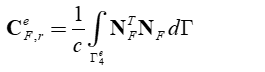
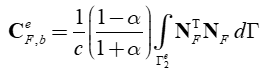
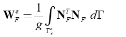

.. _FSIFluidBoundaryElement2D:

FSIFluidBoundaryElement2D Element
^^^^^^^^^^^^^^^^^^^^^^^^^^^^^^^^^

This command is used to construct an FSIFluidBoundaryElement2D element object. The FSIFluidBoundaryElement2D element is a 2-node linear acoustic boundary element object with the following features:

#. It is based on Eulerian pressure formulation [ZienkiewiczEtAl1978]_ , [ZienkiewiczEtAl2000]_ , [LøkkeEtAl2017]_ , for (Class I) fluid-structure interaction problem.
#. It uses a 2 inetgration points Gauss quadrature.
#. Depending on the input variables, it enables the implementation of radiation boundary, reservoir bottom absorption or free surface effects.

.. function:: element FSIFluidBoundaryElement2D $eleTag $n1 $n2 $cc $alpha $g <-thickness $thickness>

.. csv-table:: 
   :header: "Argument", "Type", "Description"
   :widths: 10, 10, 40

   $eleTag, |integer|, unique integer tag identifying element object
   $n1 $n2, 2 |integer|, the two nodes defining the element (-ndm 2 -ndf 1)
   $cc, |float|, speed of pressure waves in water
   $alpha, |float|, reservoir bottom reflection coefficient [LøkkeEtAl2017]_
   $g, |float|, acceleration due to gravity
   Optional:
   $thickness, |float|, the thickness in 2D problems (default 1.0).

.. figure:: FSIFluidBoundaryElement2D_geometry.png
	:align: center
	:figclass: align-center
	:width: 40%

	Nodes, Gauss points, local coordinate system
	
Theory
^^^^^^ 

.. figure:: FSIProblem_geometry.png
	:align: center
	:figclass: align-center	
	:width: 40%
	
| The element damping matrix (radiation boundary):

| The element damping matrix (reservoir bottom absorption):

| The element surface waves matrix:

.. admonition:: Example: Three cases of valid inputs are shown below: 1. Radiation boundary, 2. Reservoir bottom absorption and 3. Surface waves effects.

   1. **Tcl Code**

   .. code-block:: tcl

      # set up a 2D-1DOF model: Side Radiation Boundary
      model Basic -ndm 2 -ndf 1
      node 11  0.0  0.0
      node 22  1.0  1.0
      
      # create the acoustic boundary element at side radiation boundary with speed of pressure waves in water, cc = 1.440000e+03 (set alpha = 0, g = 0 to exclude bottom absorption and mass terms for water surface, respectively)
      set cc 1.440000e+03
      element FSIFluidBoundaryElement2D 3  11 22  $cc 0.0 0.0 -thickness 1.0
      
	  # set up a 2D-1DOF model: Reservoir Bottom Absorption Boundary
      model Basic -ndm 2 -ndf 1
      node 11  0.0  0.0
      node 22  1.0  1.0
      
      # create the acoustic boundary element at bottom boundary of a reservoir given speed of pressure waves in water, cc = 1.440000e+03 and reservoir bottom reflection coefficient, alpha = 9.990000e-01 (set g = 0 to exclude mass terms for water surface)
      set cc 1.440000e+03
	  set alpha 9.990000e-01
      element FSIFluidBoundaryElement2D 4  11 22  $cc $alpha 0.0 -thickness 1.0
	  
	  # set up a 2D-1DOF model: Free Surface Boundary
      model Basic -ndm 2 -ndf 1
      node 11  0.0  0.0
      node 22  1.0  1.0
      
      # create the acoustic boundary element at the free surface boundary of the reservoir given g = 9.807 (set alpha = 0, cc = 0 to exclude damping terms)
      set cc 1.440000e+03
	  set alpha 9.990000e-01
      set g 9.807
	  element FSIFluidBoundaryElement2D 5  11 22   0.0 0.0 $g -thickness 1.0

   2. **Python Code**

   .. code-block:: python

      # set up a 2D-1DOF model: Side Radiation Boundary
      model('Basic', '-ndm', 2, '-ndf', 1)
      node(11, 0.0, 0.0)
      node(22, 1.0, 1.0)
      
      # create the acoustic boundary element at side radiation boundary
      cc = 1.440000e+03
      element('FSIFluidBoundaryElement2D', 3, 11, 22, cc, 0.0, 0.0, thickness=1.0)

	  # set up a 2D-1DOF model: Reservoir Bottom Absorption Boundary
      model('Basic', '-ndm', 2, '-ndf', 1)
      node(11, 0.0, 0.0)
      node(22, 1.0, 1.0)
      
      # create the acoustic boundary element at bottom boundary of a reservoir
      cc = 1.440000e+03
	  alpha = 9.990000e-01
      element('FSIFluidBoundaryElement2D', 4, 11, 22, cc, alpha, 0.0, thickness=1.0)
	  
	  # set up a 2D-1DOF model: Free Surface Boundary
      model('Basic', '-ndm', 2, '-ndf', 1)
      node(11, 0.0, 0.0)
      node(22, 1.0, 1.0)
      
      # create the acoustic boundary element at the free surface boundary of the reservoir
      g = 9.807
      element('FSIFluidBoundaryElement2D', 5, 11, 22, 0.0, 0.0, g, thickness=1.0)

Code Developed by: **Massimo Petracca** at ASDEA Software, Italy.

.. [ZienkiewiczEtAl1978] | Zienkiewicz O.C., Bettess P. "Fluid-structure dynamic interaction and wave forces. An introduction to numerical treatment", Inter. J. Numer. Meth. Eng.., 13(1): 1–16. (`Link to article <https://onlinelibrary.wiley.com/doi/10.1002/nme.1620130102>`_)
.. [ZienkiewiczEtAl2000] | Zienkiewicz O.C., Taylor R.L. "The Finite Element Method", Butterworth-Heinemann, Vol.1, 5th Ed., Ch.19.
.. [LøkkeEtAl2017] Løkke A., Chopra A.K. "Direct finite element method for nonlinear analysis of semi-unbounded dam–water–foundation rock systems", Earthquake Engineering and Structural Dynamics 46(8): 1267–1285. (`Link to article <https://onlinelibrary.wiley.com/doi/abs/10.1002/eqe.2855>`_)
