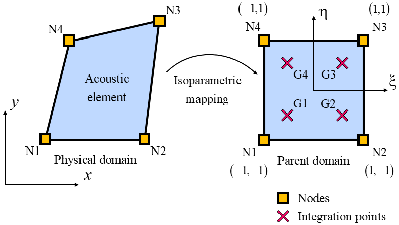

.. _FSIFluidElement2D:

FSIFluidElement2D Element
^^^^^^^^^^^^^^^^^^^^^^^^^

This command is used to construct an FSIFluidElement2D element object. The FSIFluidElement2D element is a 4-node bilinear acoustic element with the following features:

#. It is based on the Eulerian pressure formulation ([ZienkiewiczEtAl1978]_ , [ZienkiewiczEtAl2000]_ , [LøkkeEtAl2017]_) for (Class I) fluid-structure interaction problem.
#. It uses a full 2x2 Gauss quadrature, and therefore has a total of 4 integration points.

.. function:: element FSIFluidElement2D $eleTag $n1 $n2 $n3 $n4 $cc

.. csv-table:: 
   :header: "Argument", "Type", "Description"
   :widths: 10, 10, 40

   $eleTag, |integer|, unique integer tag identifying element object
   $n1 $n2 $n3 $n4, 4 |integer|, the four nodes defining the element (-ndm 2 -ndf 1)
   $cc, |float|, speed of pressure waves in water

	Nodes, Gauss points, parent coordinate system

.. note::

   Valid queries to the FSIFluidElement2D element when creating an ElementRecorder object are:
   
   *  '**pressure**', '**dpressure_dt**', '**d2pressure_dt2**':
       *  Added hydrodynamic pressure and its first and second time derivatives.
	   
Theory
^^^^^^ 
Fluid behavior. Wave equation
-----------------------------
|  The water is modeled as a linear inviscid, irrotational, and compressible fluid with added (to the hydrostatic pressure) hydrodynamic pressure p(x, y, t) governed by the Helmholtz acoustic wave equation:	

   
|  where

|  denotes the speed of sound in the fluid, K and \rho are the bulk modulus and the mass density of the fluid, respectively.

Boundary conditions. Coupling and Radiation
-------------------------------------------
| We focus on the fluid-structure interaction (Class I problem), according to [ZienkiewiczEtAl2000]_ .
.. figure:: figures/FSI_FE/FSIProblem_geometry.png
	:align: center
	:figclass: align-center	
	:width: 40%
| The appropriate boundary conditions can now be imposed and their connection with the structural governing differential equations established. Therefore,
| On boundary 1: "Solid boundary"

| which leads to

| On boundary 2: "Solid boundary"

| leading to

| On boundary 3: "Free surface boundary"
| On the free surface the selected assumption is :math:`p=\rho g\eta`, which accounts for surface gravity waves, where :math:`\eta` is the elevation relative to the mean water level and :math:`g` is the acceleration due to gravity.
| This assumptions leads to the linearized free surface wave condition:

| On boundary 4: "Radiation boundary"
| The solution of the wave equation is composed of outgoing waves only: :math:`p = f(x - ct)`. Thus
.. figure:: figures/FSI_FE/BC4a.png
	:align: center
	:figclass: align-center	
	:width: 9%
| and

| By eliminating :math:`f'` we get 

| This relation is known as the Sommerfeld radiation condition. 
| The wave equation is to be solved in a 2D region (area) :math:`\Omega_F`, subject to boundary conditions on its surface :math:`\Gamma_n`, leading to the following strong form for the fluid:

| After multiplication by a weight function, integration by parts, application of the divergence theorem and susbstitution of BCs the strong form of the problem is reduced to the weak form shown below:

| Standard Galerkin discretization applied to the weak form leads to

| The acoustic element stiffness matrix is:

   
| The acoustic element mass matrix is:   

.. admonition:: Example: Three cases of valid inputs are shown below: 1. Radiation boundary, 2. Reservoir bottom absorption and 3. Surface waves effects.

   1. **Tcl Code**

   .. code-block:: tcl

      # set up a 2D-1DOF model
      model Basic -ndm 2 -ndf 1
      node 1  0.0  0.0
      node 2  1.0  0.0
      node 3  1.0  1.0
      node 4  0.0  1.0
      
      # create the acoustic element with speed of pressure waves in water, c = 1.440000e+03
      set cc 1.440000e+03
      element FSIFluidElement2D  1  1 2 3 4  $cc
      
      # record added hydrodynamic pressures at element nodes (4 columns, 1 for each node)
      recorder Element  -xml  pressure_out.xml  -ele  1  pressure
      # record first time derivative of added hydrodynamic pressures at element nodes (4 columns, 1 for each node)
      recorder Element  -xml  dpressure_dt_out.xml  -ele  1  dpressure_dt

   2. **Python Code**

   .. code-block:: python

      # set up a 2D-1DOF model
      model('Basic', '-ndm', 2, '-ndf', 1)
      node(1, 0.0, 0.0)
      node(2, 1.0, 0.0)
      node(3, 1.0, 1.0)
      node(4, 0.0, 1.0)
      
      # create the acoustic element with speed of pressure waves in water, c = 1.440000e+03
      cc = 1.440000e+03
      element('FSIFluidElement2D', 1, 1,2,3,4, cc)
      
      # record added hydrodynamic pressures at element nodes (4 columns, 1 for each node)
      recorder('Element', '-xml', 'pressure_out.xml', '-ele', 1, 'pressure')
      # record first time derivative of added hydrodynamic pressures at element nodes (4 columns, 1 for each node)
      recorder('Element', '-xml', 'dpressure_dt_out.xml', '-ele', 1, 'dpressure_dt')

Code Developed by: **Massimo Petracca** at ASDEA Software, Italy.

.. [ZienkiewiczEtAl1978] | Zienkiewicz O.C., Bettess P. "Fluid-structure dynamic interaction and wave forces. An introduction to numerical treatment", Inter. J. Numer. Meth. Eng.., 13(1): 1–16. (`Link to article <https://onlinelibrary.wiley.com/doi/10.1002/nme.1620130102>`_)
.. [ZienkiewiczEtAl2000] | Zienkiewicz O.C., Taylor R.L. "The Finite Element Method", Butterworth-Heinemann, Vol.1, 5th Ed., Ch.19.
.. [LøkkeEtAl2017] Løkke A., Chopra A.K. "Direct finite element method for nonlinear analysis of semi-unbounded dam–water–foundation rock systems", Earthquake Engineering and Structural Dynamics 46(8): 1267–1285. (`Link to article <https://onlinelibrary.wiley.com/doi/abs/10.1002/eqe.2855>`_)
