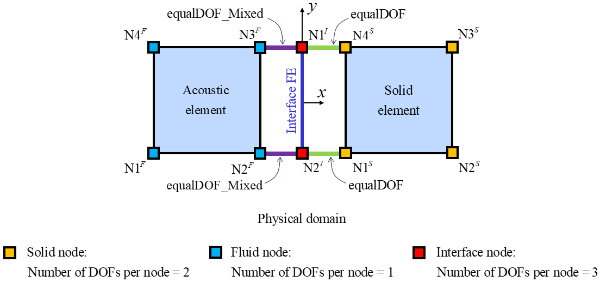

.. _FSIInterfaceElement2D:

FSIInterfaceElement2D Element
^^^^^^^^^^^^^^^^^^^^^^^^^^^^^

This command is used to construct an FSIInterfaceElement2D element object. The FSIInterfaceElement2D element is a 2-node linear acoustic-structure interface element object with the following features:

#. It is based on Eulerian pressure formulation [ZienkiewiczEtAl1978]_ , [ZienkiewiczEtAl2000]_ , [LøkkeEtAl2017]_ , for (Class I) fluid-structure interaction problem.
#. It couples the structure and fluid domains.
#. It uses a 2 inetgration points Gauss quadrature.
#. It has three DOFs: two displacements and one pressure DOF. The nodes in the acoustic domain share the same coordinates with the nodes in the solid domain.

.. function:: element FSIInterfaceElement2D $eleTag $n1 $n2 $rho <-thickness $thickness>

.. csv-table:: 
   :header: "Argument", "Type", "Description"
   :widths: 10, 10, 40

   $eleTag, |integer|, unique integer tag identifying element object
   $n1 $n2, 2 |integer|, the two nodes defining the element (-ndm 2 -ndf 3)
   $rho, |float|, the mass density of the fluid domain (acoustic medium)
   Optional:
   $thickness, |float|, the thickness in 2D problems (default 1.0).

	Nodes, Gauss points, local coordinate system
	
Theory
^^^^^^ 

	
| The element coupling matrix at the interface between the water reservoir and the structure is given by:
.. figure:: Se_h.png
	:align: center
	:figclass: align-center	
	:width: 15%
| while for the bottom interface between the water reservoir and the soil domain
.. figure:: Se_b.png
	:align: center
	:figclass: align-center	
	:width: 15%

.. admonition:: Example 

   1. **Tcl Code**

   .. code-block:: tcl

      # set up a 2D-3DOF model
      model Basic -ndm 2 -ndf 3
      node 11  0.0  0.0
      node 22  1.0  1.0
      
      # create the acoustic-structure interface element with input variable rhoW
      set rhoW 1.000000e+03;  # mass density of water
      element FSIInterfaceElement2D 2   11 22   $rhoW -thickness 1.0

   2. **Python Code**

   .. code-block:: python

      # set up a 2D-3DOF model
      model('Basic', '-ndm', 2, '-ndf', 3)
      node(11, 0.0, 0.0)
      node(22, 1.0, 1.0)
      
      # create the acoustic-structure interface element with input variable rhoW
      rhoW = 1.000000e+03  # mass density of water
      element('FSIInterfaceElement2D', 2, 11, 22, rhoW, thickness=1.0)

Code Developed by: **Massimo Petracca** at ASDEA Software, Italy.

.. [ZienkiewiczEtAl1978] | Zienkiewicz O.C., Bettess P. "Fluid-structure dynamic interaction and wave forces. An introduction to numerical treatment", Inter. J. Numer. Meth. Eng.., 13(1): 1–16. (`Link to article <https://onlinelibrary.wiley.com/doi/10.1002/nme.1620130102>`_)
.. [ZienkiewiczEtAl2000] | Zienkiewicz O.C., Taylor R.L. "The Finite Element Method", Butterworth-Heinemann, Vol.1, 5th Ed., Ch.19.
.. [LøkkeEtAl2017] Løkke A., Chopra A.K. "Direct finite element method for nonlinear analysis of semi-unbounded dam–water–foundation rock systems", Earthquake Engineering and Structural Dynamics 46(8): 1267–1285. (`Link to article <https://onlinelibrary.wiley.com/doi/abs/10.1002/eqe.2855>`_)
